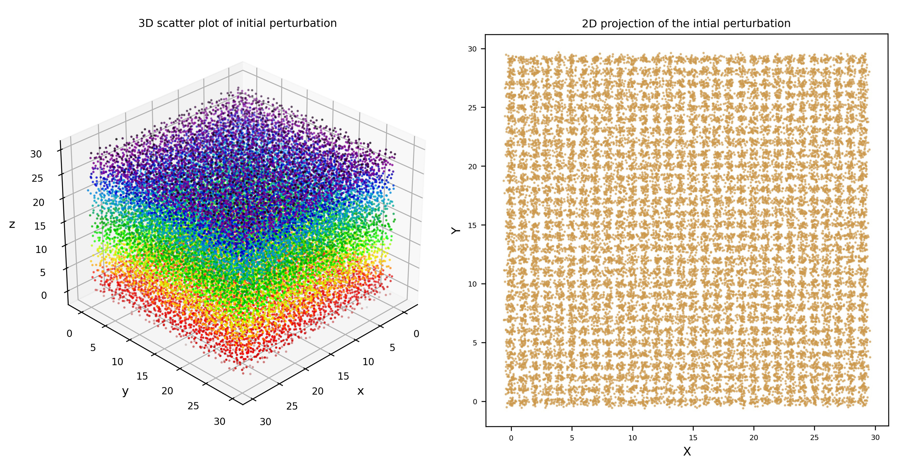
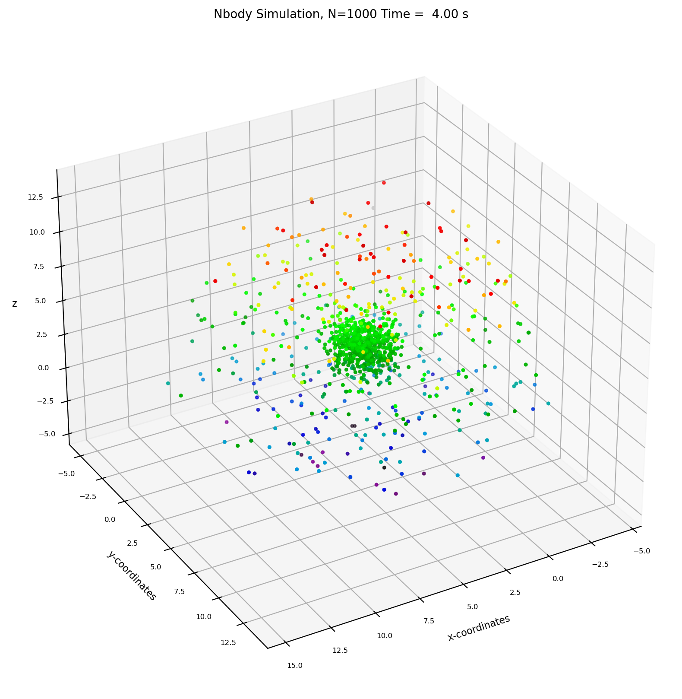
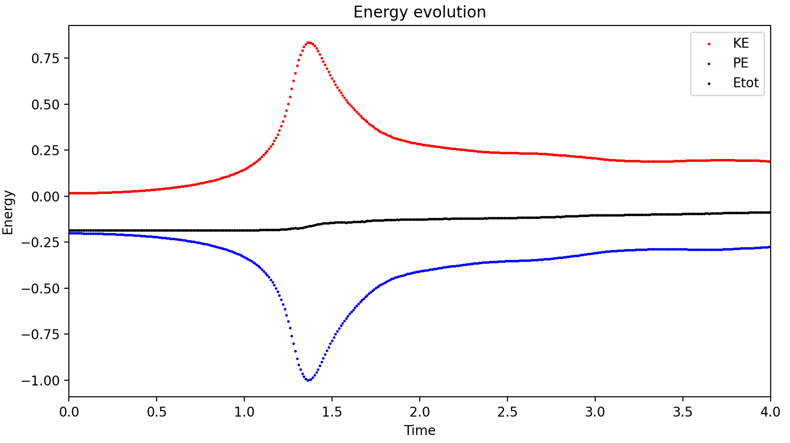

# Simple N body simulation

The initial perturbation are as follows:

Now, remember, that here the number of particles taken are more just as an exaggeration to what's actually been taken while running the simulation.        

## Working
The code is a simple implementation of particle - pair method, where force is computed for each pair and then summed over for each such pair After that we using the Leapfrog integration we calculate the postion and velocity, and iterate over again.

### There are three main functions required for doing the simualation.

    accleration(pos, mass, G, softening)
This  function calculates accelration from particle-pair method.  
 Suppose that the position of particle of interest $j$ be $x_j$ and then there are $N$ such particles. Then we calulate the relative vector between each such pair i.e $\vec{r_{ji}} = \vec{x_j} - \vec{x_i}$ where $i=\{1,2,\ldots,N\}$.  Then using Newton's Law of graviation we calulate accleration for each such pairs and thus the net accleration becomes

$$  \mathbf{a}_j = G\sum_{i\neq j}m_i\frac{r_{ji}}{|r_{ji}|^3} $$
we use the softening parameter so that the relative distance never becomes zero.        
This function returns a $N\times 3$ matrix conatining the accleration vector i.e $[a_x,~a_y, ~a_z]$ of each particle.       

    energy(pos, vel, mass, G)
This function calculates the energy the of the total system.        
The `vel` parameter here is a $N\times 3$ matrix that contains the velocity vector of each particle, $[v_x,~v_y,~v_z]$ so for the particle $i$ its easy to calculate the magnitude as $v_i = \sqrt{v_{i,x}^2 + v_{i,y}^2 + v_{i,z}^2}$ Thus we can calulate the kinetic energy of each particle as $\dfrac{mv_j^2}{2}$.     

Then we calculate Gravitional Potential Energy between each pair, for that we need the relative distance between each particle which we do the same way as before. Then the Graviational potential energy for particle $i$ and $j$ will be $-G\dfrac{m_im_j}{r_{ij}}$.       

We sum the kinetic energy for each particle and potential energy for each such pair. Thus the total energy is:
$$E_{tot} = \sum_{i=1}^N \frac{m_iv_i^2}{2} ~~ - \sum_{1\leq i \leq j\leq N}G\dfrac{m_im_j}{r_{ij}}$$       

For a good simulation, the total, energy should be near 0 through out the simulation and should remain more or less constant.       

    main(N, tEnd, dt, softening=0.1, energyplot=False, plotRealTime=True)
This funtion is the main function which runs the simulation. The paramerters are self-explanatory and are descibed in the the `nbody.py` also.      
Don't keep the Number of of particles too High, as this code is vectorized, so it have a drawback of large memory requirement.      
This function initializes the inital grid and perturbation. If you don't want the perturbations, then you can distribute the paricles randomly as well, by _un-commenting_ this line :        
`pos = np.random.randn(N, 3)`       

Note that the grid form is a cube, so make sure that the $N$ you chose is a cube of some integer.       

## Sample output
I ran the code for $N = 1000$ and here is the output

and here is the energy associated with the evolution

$$ \text{Have fun with this}$$

### Credits
This code implementation is based on the code implemented by <a href='https://github.com/pmocz/nbody-python'>Phillip Mocaz</a>
