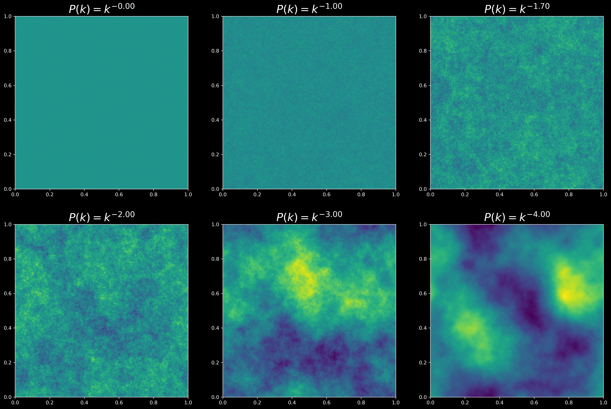

# Gaussian Random Field Generator

The scripts in this folder are used to generate random fields. An example of the script is shown below.

## Descriptions of the files
- The file [GRF.py](GRF.py) is the main script. It contains the main function and the functions for generating the random fields.       
- The Jypyter Notebook file [GRF.ipynb](GRF.ipynb) contains step-by-step guidelines for generating the random fields. The mathematics of the random fields will be added later.     
- The file [GRF_volume.py](GRF_volume.py) is used to generate a 3D simulation volume random fields.

Below is an example after running the main function. It generates GRF for different starting conditions.

